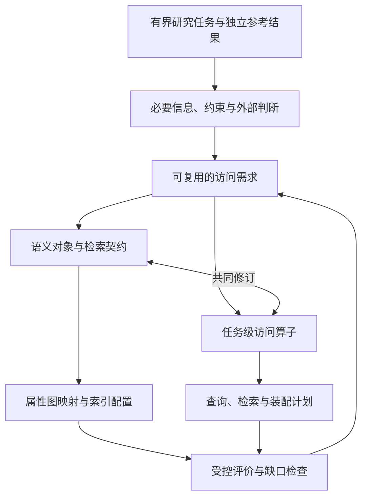

# 学术文献数据网络：研究顶层设计 v2

> **研究定位：** 面向有界的 CS 研究知识利用任务，设计建立在属性图之上的语义数据访问层，共同组织持久知识的语义对象模型与可组合的任务级访问算子。
>
> **核心问题：** 如何让外部 Agent 通过明确的信息需求和约束访问积累的论文衍生知识，并在检索、关联、组合与维护中保留必要的身份、条件、来源和版本语义？
>
> **当前状态：** 设计方向与责任边界已明确；三类对象及算子是候选方案，具体 benchmark、实现范围与贡献效果仍需验证。末尾“原始表达”仅作历史备忘，不作为当前方案的约束。

## 1. 研究出发点：支持 Agent 利用持续积累的研究知识

我们的出发点包含两个选择：**面向 Agent 利用学术论文及相关材料支持研究者的需求，并从数据库视角优化这些需求的数据支持。** 研究者阅读论文，是为了理解问题、寻找方法、比较结果或准备实验。一次阅读形成的理解会在之后继续使用，新论文、新版本与新的核验结果也会补充或修正已有认识。

因此，系统管理的是持续积累的知识、解释、关联及其依据：

| 管理内容 | 例子 | 必须保留的区别 |
| --- | --- | --- |
| 可引用对象与研究定义 | 论文、数据集、实现、方法、指标 | 资源身份、概念定义与适用范围 |
| 具体表达与记录 | 主张、实验报告、检查记录 | 谁在什么材料或条件下表达、报告或观察了什么 |
| 关系与依据 | 实现对应、实验参与、支持或限定关系 | 已存判断及其来源，不等同重新验证的事实 |

论文、附录、代码和数据等材料是知识来源；系统也可保存外部检查与实验形成的新记录。“论文理解”由外部研究者或 Agent 完成，中间件管理其产物，并支持后续查询、组合与显式更新。

上述内容先说明研究需要什么信息，不预设它们必须划分为哪几类节点。我们关心的是阅读形成的知识如何在后续任务中继续发挥作用，以及复用时是否仍保留原来的条件、来源和版本。

### 1.1 研究选择与论证责任

**支持学术知识利用、从数据管理角度研究，是我们的立足点。** 不需要先证明这一方向优于所有 Agent 优化方向，才有资格开展研究。但这个选择也不自动证明提出的方法有效：我们必须说明所选场景的数据需求确实存在，任务选择有依据，方案在这些任务中能够产生可验证的价值。

这两种责任需要分开。研究立足点回答“我们选择研究什么”，workload 的依据回答“哪些需求值得在这里研究”，后续方法与对照回答“怎样支持、是否有效”。不能用研究选择替代效果证明，也不能把“为什么不去研究另一个方向”当成本研究必须首先解决的问题。

### 1.2 领域限定与 Agent 可替换性共同确定优化对象

我们希望限定知识利用的任务领域，同时让外部 Agent 保持可替换：接口与数据语义不依赖特定 Agent 的内部推理实现。这里的领域专用性落在数据表示和访问契约上；它并不要求训练或绑定一个专用研究 Agent。

```text
研究对象：Agent 利用论文及相关材料支持研究
    ↓ 选取有依据、有边界的知识利用任务
任务侧：明确需要支持的信息与操作范围
    ＋
Agent 侧：理解、判断和决策保持外部可替换
    ↓
可重点设计的对象：
知识如何表示 + 如何被访问和组合 + 操作结果如何继续使用与维护
```

**由此，我们把研究重心放在 Agent 与研究数据交互的抽象层。** 有限领域允许我们利用稳定的需求设计公共机制，外部 Agent 则负责随用户需求变化的解释和判断。这是一项有理由的研究选择，不是声称剩余优化机会只有数据库。不同 Agent 的使用效果仍需评价；隔离中间件收益时，应固定 Agent 条件。

## 2. 推导 workload：为研究范围与方法设计提供依据

### 2.1 从知识利用需求选择代表性 intent

“支持学术研究”仍然过于宽泛。我们暂以 **Knowledge Utilization Workload（知识利用工作负载）** 收敛范围：研究者或 Agent 为当前问题取得、关联、核查和复用论文衍生知识。这个范围使我们可以围绕知识利用深入设计，同时不必覆盖科研活动的全部环节。

Intent 的选择需要先于对候选模型的效果判断。不能因为模型容易回答某些问题，就反过来把这些问题称为代表性 workload。当前选取六类需求，是因为它们既有公开任务或文献依据，也要求不同的信息产物：

| 候选 intent | 需求依据与采用边界 | 对应的信息产物 |
| --- | --- | --- |
| 发现工作与方法 | PaperFindingBench 支持按需求发现论文；方法适用性是本研究扩展 | 候选集合及适用条件 |
| 理解机制与细节 | QASPER 的全文信息需求与带证据问答 | 细节答案及来源 |
| 整理实验结果 | 科学 leaderboard 信息抽取支持任务、数据、指标、分数整理；可比性判断是扩展 | 保留评测条件的结果对照 |
| 综合路线与发现 | ScholarQA-CS 与 ArxivDIGESTables 的多论文综合、比较表任务 | 跨来源的组织结果 |
| 核查主张 | QASPER、SciFact 提供证据问答与核查形式；SciFact 原领域不直接代表 CS | 支持、限定或相反材料及判断范围 |
| 准备实现资源 | CORE-Bench、PaperBench 提供资源与配置需求；资源发现是前置扩展，执行与核验交给外部 | 资源对应、配置及其原文依据 |

来源链接、具体改写及完整实例见 [代表性 Intent 的分解](intents_decompose.md)。这些依据说明需求存在，信息产物的差异说明选择不只是同一种查询的换名；它们尚不证明使用频率上的代表性，也不证明对所有科研行为的完备覆盖。

**顶层的论证责任是需求为什么值得选择；分文档负责把每项需求展开为可检查的任务。** 后续选定真实材料与评价实例时，应在明确范围内逐项核对覆盖与遗漏，而不要求穷尽所有“元 intent”。具体 benchmark 仍待确定。

### 2.2 从 intent 形成可评价的任务和 workload

```text
Intent：使用者希望达成的目的
   ↓ 明确输入、约束、材料环境、质量要求与预期输出
Task：具体、可评价的任务
   ↓ 选择代表性实例，固定数据状态、参考结果与访问/更新需求
Workload：用于设计和评价系统的一组任务与数据操作需求
```

例如，“找适合我当前条件的方法”是 intent；给定标注量、计算资源、允许访问的材料和所需依据，才形成可评价的任务。一次 Agent 执行轨迹可以帮助发现需求，但其偶然步骤不能定义 workload。同一个任务可能有多种合理执行方式，任务要求必须能够独立于某个 Agent 的策略来描述。

进一步要区分三个层次：任务必须取得哪些信息；取得它们需要哪些关系与约束；某种实现为此选择了哪些查询步骤。前两者约束设计，第三者可以随数据表示和执行策略变化。

以“比较 A、B 在数据集 D 上的结果”为例，必要信息包括实际结果及其方法、数据、指标、条件和来源。它不直接决定必须有一个 Experiment 节点、多个 Result 节点，或哪些信息应存为属性。**信息需求相对稳定，不等于节点划分固定。**

### 2.3 有界 workload 为模型专门化提供空间

当任务范围、材料环境和结果要求逐步明确后，我们就可以优先表达其中反复需要的身份、条件、来源和关系，而不必事先为任意领域、任意数据结构提供同等丰富的语义。这里“限定 workload”指声明支持边界，不是锁死每个自然语言问题或每条执行路径。

作者、机构等信息可以先作为描述字段；如果当前任务不需要独立定位和操作它们，就不必建设完整的学术社交网络。反之，一旦真实任务需要相应关系，就应重新评估模型范围。排除或纳入对象的理由来自操作需求，而不是对某类信息是否重要的普遍判断。

因此，workload 同时承担两项作用：**约束模型不无限扩张，并提供寻找公共访问结构的依据。** 是否真的存在可复用的结构、能够覆盖哪些任务，还要通过多实例分解来检查；“领域有界”提供设计机会，不自动证明一套小型算子就足够。

## 3. 设计空间：共同优化数据模型与访问方式

### 3.1 两种设计重心，以及本研究的选择

给定数据库后，可以提供 schema 探知、使用说明、查询示例和约束检查，帮助 Agent 更好地理解结构并编写 SQL 或 Cypher。这是一条合理路径。对于本研究，还存在另一项可以利用的自由度：材料范围与任务需求已被限定，数据模型本身也由我们设计，因此可以把表示与操作方式一起调整。

| 设计重心 | 主要给定条件 | 主要优化对象 |
| --- | --- | --- |
| 帮助 Agent 操作给定数据系统 | 已有 schema、查询语言及数据组织 | 结构理解、查询构造、验证与修正过程 |
| 从有界知识利用任务共同设计系统 | 任务信息需求与材料范围 | 数据语义、对象组织、可复用操作及其执行映射 |

这是两种设计选择的比较，不是对现有工作的穷尽分类，也不意味着二者互斥。我们的系统仍需要清楚的 schema、接口说明与正确的查询执行；区别在于研究可以利用任务边界，把某些反复出现的信息访问要求做成稳定契约。

例如，方法比较、证据核查和资源准备都可能需要“取得某对象的实验与依据”。如果每次都由 Agent 重新发现关系路径和装配来源，就存在可研究的重复工作。是否能够将其统一表达、是否比充分说明的查询模板更有效，要通过实例与实验回答。

### 3.2 从优化机会到方法假设

我们的目标是减少反复理解底层结构、构造领域查询和修正操作的负担，同时保持结果可组合、条件可解释、来源可追踪。这要求数据表示提供操作依赖的区别，操作则把这些区别用于访问并保留给后续任务。只改接口名称或只增加若干节点类型，都不足以完成这项设计。

**因此，数据模型与访问方式是同一方法的两个部分。** 一个面向 Agent 的工具是交付入口，研究机制则在其背后的对象语义、访问契约和实现规则。工具接入形式本身不能证明效果。

研究立足点允许我们选择这条路线，但不免除方法比较：“图谱 + schema 说明 + Agent 编写 Cypher”、合适的查询模板以及可比检索组合，都仍是需要认真面对的基线。区别研究目标与证明优越性，是保留这一设计空间而不预设结论的关键。

## 4. 推导方法：任务、对象与算子共同迭代

### 4.1 表示与操作相互依赖，不能靠章节顺序消除

具体查询需要数据表示，而合理的数据表示又需要任务及操作需求来约束。这种相互依赖不能只靠把章节排成“workload → schema → operator”解决，也不能先固定三类节点，再把任务塞进既有接口。

我们使用可修订的临时数据约定启动分析：为一个真实任务说明已有什么信息、如何对应、哪些内容尚未记录，再写出数据取得和外部判断的过程。临时约定可以使用普通记录、逻辑关联或属性图草稿；v1 可以提供材料，但不自动成为 v2 的要求。

| 临时约定 | 共同设计后的模型与算子 |
| --- | --- |
| 让一个实例的信息与操作可以被具体表达 | 统一支持选定 workload 中的可复用需求 |
| 可以局部、重复，也可以暴露缺失 | 需要明确身份、类型、来源和组合约束 |
| 用于发现问题，不承担贡献结论 | 接受独立任务和对照实验检验 |

### 4.2 在多个任务之间提取共同结构

每个任务展开为“必要数据 + 数据操作 + Agent 判断”。然后比较：哪些信息反复被需要，哪些条件与关系反复被检查，哪些中间结果必须供后续操作继续使用。共同结构可能是同一查询的参数变化，也可能是不同 intent 共享的一段访问与组织过程。

例如实验比较需要方法、数据、指标、设置与证据，资源准备也可能需要其中的实验记录；两者可共享数据取得部分，但可比性与可用性判断的目的不同。抽象时要保留这一边界，不能把整个任务强行封装成同一个算子。

**同一组需求同时约束模型与算子。** 信息没有被表示，算子无法取得它；操作不能保留局部对应和来源，再丰富的表示也无法保证后续使用。发现缺口时，应比较修改表示、修改操作或保留外部判断的不同代价。




这一过程允许多个合理实现并存。需要区分任务固有的信息需求和某种表示额外引入的步骤；不能仅因查询形状重复，就认定存在领域固有算子。临时约定可以不完整，但必须暴露字段、关系或材料缺失。

**研究假设：** 有界任务中存在一组可复用、可组合的信息访问结构，其所需的数据语义能够由稳定契约表达。这是待检验假设，不由查询模板重复出现自动证明。

### 4.3 用两层表达保持可检查性

| 表达层 | 内容 | 作用 |
| --- | --- | --- |
| 端到端任务表达 | 数据变量、候选访问算子、外部 Agent 判断及分支/循环 | 检查信息流、判断依据和结果是否符合 intent |
| 后端实现表达 | 参数化 Cypher、索引检索、融合、分组和材料读取 | 检查算子确实取得所承诺的数据，且没有隐藏推理 |

候选算子可以从分析开始就使用，但必须展开其输入、输出、关系路径与未满足条件，不能用“取得相关信息”替代机制说明。具体表达见 [intents_decompose.md](intents_decompose.md)。Cypher 是验证与实现映射的工具，不再被当作所有端到端任务唯一的表达单位。

Agent 的工作在伪代码中写作 Agent 算子：`Extract`、`Summarize`、`Generate`（生成内容）、`Check`、`Verify`、`Filter`（逐项 T/F/U 判断）与 `Rank`、`MatrixConstruct`（对结构化记录的确定性组织），名称沿用 AgenticScholar，定义按本项目的使用场景重新规定（[算子契约](operators.md) §4）。内容由 Agent 生成后交给中间件校验，中间件不调用 LLM、不主动调度；每次调用的产物持久化为 Artifact。判断输入、依据及用途必须可见；未知不并入否定，也不把语义比较当作可任意下推的普通等号。

### 4.4 一个必须共同调整的例子

实验结果最初可以保存在一份来源化记录的异构表格中，由 Agent 解析。如果任务频繁需要独立访问某个结果，可以把它拆为内部结果单元或独立记录；如果还需要直接数值筛选，就应将指标、数值和条件键提升到检索面。

每一步都改变构建成本、来源粒度、可执行约束以及访问算子的装配方式。粗粒度报告中共同出现的方法和数据，不自动具有“同一结果行”的对应关系。**表示变化只有保留相同绑定与结果含义时，才可作为同一契约的替代实现；否则必须修改契约。**

## 5. 核心方法：面向 Agent 的语义数据访问层

前述推导确定了需要共同设计什么。由此提出的候选方法是：以语义对象表达必要信息，以可组合的访问契约组织反复出现的数据操作。以下解释这一方法的含义，具体算子仍需接受任务检查。

### 5.1 以少量类型化访问算子覆盖数据操作

Agent 的研究任务既包含结构化条件，也包含开放文本匹配、多跳关系与材料依据需求。我们提出的接口用**少量可组合的类型化访问算子**表达这些信息取得任务：`Search`（类别内按查询与结构条件发现）、`Resolve`（说法到引用）、`Traverse`（沿声明的关系与方向导航）、`ReadEvidence`（读取固定材料），写入经 `Commit`（[算子契约](operators.md) §3）。

例如：

> 取得方法 M 在数据集 D 上的已记录实验，并返回参与角色、原文锚点与来源。

这可能涉及对象解析、参与关系过滤、实验分组和来源装配。返回结果应包含实验及满足条件的参与绑定，而不只是几个相似节点。

算子粒度位于完整研究任务与底层操作之间：

| 层次 | 例子 | 责任 |
| --- | --- | --- |
| 用户 intent | 判断方法 M 能否用于我的实验 | 包含目的、开放条件与最终判断 |
| 访问算子 | 按类型化条件取得实验记录及参与绑定 | 具有可声明的输入、约束和输出，可跨 intent 复用 |
| 底层执行组件 | 精确查找、全文/向量召回、图模式匹配、关联与分组 | 实现具体数据访问与结果装配 |

“写一篇综述”通常过大，“沿一条物理边走一步”又过于贴近存储。设计过程中曾为对象发现、上下文取得、实验记录组织和主张依据访问分别设想专门算子；2026-10-04 按功能覆盖收敛为上述少量算子：intent 推导出的领域语义体现在各类别的结构条件、对象视图与路径约束中，而不是为每类信息取得任务单设一个预设语义的算子。接口是否值得独立存在，仍由复用范围和可检验契约决定。

### 5.2 系统执行约束，外部 Agent 判断开放语义

| 条件或操作 | 中间件负责 | 外部 Agent 负责 |
| --- | --- | --- |
| 已存实现关系、实验参与关系 | 按显式字段与关系求值，返回匹配依据 | 确定目标及所需条件 |
| 文本与任务相关 | 召回、排序，说明匹配与覆盖范围 | 判断候选是否适用，改写需求 |
| 实验是否可比、材料是否支持结论 | 提供记录、上下文和材料 | 解释条件并作带依据的判断 |
| 选择下一次操作 | 执行已提交操作 | 决定补检、读取、更新或停止 |
| 抽取、概述与判断的结果 | 校验 Agent 算子的输入、出处与格式，持久化为 Artifact，确定性执行排序与透视 | 生成抽取值、概述与逐项判断 |

因此，此处“语义”指接口承载明确的领域含义、类型和关系契约，不表示中间件内部主动运行 Agent 理解开放条件。**约束求值、语义候选召回与研究判断是不同职责。** 未记录关系不能直接解释为现实中不存在该关系。

### 5.3 从逐步调用走向可连续执行的算子组合

**算子设计同时追求两个目标：减少重新规划，形成更长的连续执行段；减少新语义计算，用显式表示和规则替代判断。** 2026-10-01 的讨论进一步明确了这一目标：语义判断保留在外部，并不意味着每两个算子之间都必须由 Agent 阅读结果、解释数据并决定如何接续。受 Codemode 编排思路启发，我们希望用程序表达已经明确的数据依赖和执行规则，并通过模型与算子的共同设计，减少原本需要 Agent 衔接的环节。


图左侧表示 `Operator₁ → Agent_pred → Operator₂ → Agent_pred → Operator₃`：每次工具返回后，中间结果进入模型上下文，再由 Agent 组织下一次调用。右侧表示 Agent 先形成 `F(Operator₁, …, Operatorₙ)`，其中仍可包含判断类 Agent 算子（`Check`、`Verify`、`Filter`；图中记作 `Agent_pred`）节点，由执行环境按组合规则连续调用；消除的是每一步回到模型重新规划。图中的 `syntax` 表达变量绑定、顺序、循环、条件分支等组合方式，不预设必须开发新的查询语言；右侧是希望扩大覆盖范围的执行形式，也不要求整个任务一次完成、完全消除外部判断。

左侧的中间环节需要逐项分析。概念是否同义、实验是否可比等问题，在当前数据与显式规则不足以决定时，需要 Agent 解释和判断；遍历候选、按已有字段筛选、连接记录和装配依据，则可以交给程序执行。进一步，如果 Agent 反复从描述中恢复同一种对应关系或条件，也应检查是否值得把这些信息显式表示，并纳入算子契约。**优化对象既包括现有步骤的执行方式，也包括导致反复解释的表示与接口缺口。**

例如，在方法目标已经确定、所需关系与记录已经入库的条件下，以下访问可以连续执行：

```text
方法引用、数据集引用
  → 取得以该方法为被测对象的实验
  → 按 evaluation_data 角色筛选数据集
  → 装配参与角色与原文锚点
  → 返回实验、角色与材料位置
```

如果参与关系只藏在自由文本中，或者实验没有绑定原文锚点，增加编排语法不能自动补足这些信息；需要共同调整数据表示和访问契约，或保留显式的外部判断。返回共同参与的实验，也不等于证明这些实验可比。

可组合性因而包含三个层次的要求：

| 层次 | 设计要求 | 检查方式 |
| --- | --- | --- |
| 输入输出可衔接 | 结构化结果、稳定引用、明确类型与集合处理规则 | 普通程序能否直接消费上一步输出，构造下一步输入 |
| 组合保留语义 | 保留对象绑定、条件、来源、版本，以及缺失和截断状态 | 后续操作是否仍能区分每个结果为何入选、对应哪些记录 |
| 减少中间判断 | 将反复需要解释的数据处理转为显式表示和操作规则 | 剩余 Agent 介入点是否确实需要新解释、判断或策略调整 |

基础调用衔接相对直接；难点在于组合后仍保留正确含义，以及在具体 workload 中识别哪些判断可以被显式数据和规则替代。当前追求的是**典型任务中更长的可连续执行组合段，以及明确的外部判断点**。这不要求所有算子任意组合，也不预设完整的新代数或通用编译器。编排可由外部程序或 Agent 执行环境承担，中间件仍只执行显式提交的操作，不主动调度 LLM 判断。

契约明确的 Agent 算子（如 `Extract`、`Check`、`Filter`）可以作为预先编排程序中的特殊节点，由校验和确定性 router 接续执行；一次模型计算不必意味着重新规划。因而需分别记录确定性数据处理、新语义计算和编排介入。各 intent 的候选判断点及连续执行范围见 [intent 分解 §5.1](intents_decompose.md#51-共同材料选择规则与判断点审计)；其中仍需判断的位置仅相对于当前表示与规则成立。

评价时还应区分 Agent 介入次数与新语义判断的工作量：批量提交多组实验可比性判断可以减少往返，却未必减少判断本身；利用显式条件筛选或复用适用的已存判断，才可能进一步减少新判断。减少交互需与结果正确性、语义保留、构建及维护成本一并检查，不能仅凭工具调用次数下降判断设计有效。

#### 5.3.1 候选验证方案：让 Operator 接受 Pi Codemode 的考验

可以将 Pi Codemode 作为外部组合执行环境，检验一个具体问题：**当 Agent 希望生成程序来使用这些 Operator 时，接口是否足以支持连续执行，还是仍需要模型在调用之间解释返回值、修补数据对应关系？** 这是候选设计检验，尚未确定实验实例或开展实现。具体接入方式需在实施时核对 Pi 版本、工具暴露方式与执行环境限制；可组合性要求本身应独立于该 harness。

候选方案分为三个递进步骤：

| 步骤 | 做法 | 主要回答的问题 |
| --- | --- | --- |
| 人工编排检查契约 | 为已选任务手工写出调用候选算子的短程序，在固定数据状态上与独立参考结果比较 | 不依赖 Agent 编程能力，算子本身能否正确衔接 |
| Agent 编排检查可用性 | 提供同一组算子的类型、契约和使用说明，让 Agent 在 Codemode 中生成并执行组合程序 | Agent 能否理解接口、形成有效组合，以及需要多少修正 |
| 逐步调用与组合执行对照 | 在相同知识、算子契约、模型和声明预算下，比较逐步调用与 Codemode 编排 | 组合是否减少中间上下文与介入成本，同时保持结果质量 |

第一步可以先用普通程序表达契约，不必等待 Pi 接入。若人工程序也必须解析面向人的文本、猜测引用或重新推断对应关系，说明表示或接口尚有缺口；若人工程序可执行而 Agent 生成失败，则需要进一步检查接口说明、计划构造或编程能力，不能直接归因于算子不可组合。

初始实例可从现有 intent 中选择以下短链，具体材料和参考结果仍需确定：

- **资源定位：** 给定已确定的方法引用，取得已存实现关联及其来源，返回满足明确条件的资源与依据。
- **实验上下文取得：** 给定方法和数据集引用，取得实验及参与角色、原文锚点与来源绑定，程序完成按显式字段分组；结果行与可比性判断由 Agent 按锚点读取原文完成。
- **主张依据访问：** 给定主张引用，取得已存支持或限定关系及材料位置，按来源版本组织结果；是否足以支持当前结论仍由外部判断。

每个实例先标出预期可连续执行的部分和必要判断点，再记录实际执行中所有返回模型的原因。问题至少区分为：输入输出类型不衔接、数据表示缺失、绑定或来源在组合中丢失、分页或截断处理不清、确需新语义判断、Agent 计划或代码错误，以及执行环境限制。修订接口应针对可复用缺口，不能靠为每个实例新增一个端到端工具来消除所有中间步骤。

记录应覆盖结果及绑定正确性、可连续执行的组合段、模型往返次数、进入模型上下文的中间数据量、新语义判断的数量、程序修正次数，以及总时延和执行成本。算子调用、底层查询和模型调用需分开计数：程序内部仍可能执行大量工具调用，减少模型往返不代表减少了数据库工作。分页、空结果、缺失版本和部分失败也应作为契约检查情形，避免只证明正常路径能串起来。

判断方案有效的依据是：在预先声明的任务与数据条件下，组合段能由程序完成，结果保留必要语义，剩余 Agent 介入点可以解释，并且收益未被质量下降或额外成本抵消。若要进一步将收益归因于我们的算子设计，还应让直接 Cypher 或查询模板基线获得相同的程序编排能力，区分通用 Codemode 编排收益与领域访问契约的收益。

### 5.4 与直接 Cypher 的关系

“图谱 + schema 说明 + Agent 编写 Cypher”是有效的实现与比较起点。我们的设计关注 Agent 可直接使用的信息访问契约，底层仍可执行 Cypher，也可结合索引调用、结果融合和文件读取；一个访问算子不必一一对应一条查询语句。

已有系统支持混合召回后通过图查询取得上下文，例如 [Neo4j GraphRAG 的检索接口](https://neo4j.com/docs/neo4j-graphrag-python/current/user_guide_rag.html)。因此，“把向量检索和图遍历组合起来”本身不足以成为贡献。我们需要验证的是：**所选任务是否存在值得稳定封装的语义契约，以及相应模型、组合与维护机制是否带来实际收益。**

## 6. 数据抽象：语义对象及其检索面

以下模型原则是共同设计过程中的候选回应，不是选择 workload 的前提。判断依据是它们能否支持已明确的信息需求、保持必要区别并复用访问方式。

### 6.1 描述面是全集，检索面是其子集

设对象 $o$ 的完整描述为 $D(o)$，类别 $T$ 的检索字段契约为 $R_T$：

$$
R_T \subseteq \mathrm{fields}(D(o))
$$

类内共享 $R_T$ 的字段含义、类型、索引及关系处理规则；$\mathrm{fields}(D(o)) \setminus R_T$ 可在类内异构。

描述面包含对象的全部字段及关系角色；Agent 可以消费整个描述面。检索面选择其中由中间件直接消费的部分，包括精确匹配字段、语义检索文本以及具有明确含义的关系约束。

**描述面不等于一个独立的 metadata 容器。** metadata 至多承载尚未进入统一检索契约的异构部分。系统可以存取这些内容，但不隐式解释其领域含义；若它们需要参与数据库过滤、排序或关联，就要显式提升为有类型的检索字段或关系角色。

### 6.2 三类候选由访问特性区分

| 类别 | 对象特性 | 候选检索字段与处理差异 |
| --- | --- | --- |
| **Entity** | 可指认和使用的资源，如 Paper、Dataset、Benchmark、Code、Model、Tool | 标识、名称/别名与资源描述；资源指称与实现关系约束 |
| **Concept** | 有定义和范围的研究对象，如 Method、Task、Issue、Proposition | 术语/别名、定义与范围；显式上下位、组成、任务及命题间正反关系扩展 |
| **Content** | 有来源的作者主张、实验报告、贡献，以及阅读者的理解、结论与评估，如 Claim、Experiment、Contribution、Observation | 内容文本、来源与参与对象；按来源和上下文组织，不默认使用 alias 身份检索 |

三类可以复用全文、向量、匹配和图遍历组件，但不强制共享完全相同的字段、通道和扩展规则。**统一目标是类内契约统一；类间差异必须由字段或处理语义的实际差异支撑。**

Paper 作为 Entity 表达书目对象，其摘要可以直接提供资源 description；论文中的方法、主张和实验分布在其他语义对象中。数据集或代码库使用相同职责的资源描述，无需统一叫 abstract。Observation 保存阅读者或 Agent 在阅读与分析中形成的理解、解释、结论与评估；仓库检查、执行和复现的结果不入库。它与论文作者的 Claim 分开，保留形成者、时间、对象和依据；自由文本理解不强制变成 T/F/U。Agent 算子每次调用的产物自动持久化为第四类节点 Artifact，是未经审定的工作痕迹，记录用到了哪些节点；需要长期积累的结论仍由提交者经 `Commit` 显式写成 Observation。Contribution 既可以是论文自述的贡献，也可以是 Agent 认为的贡献，以 `stated_by` 区分。

Benchmark 保留为具有独立身份的评测资源。自身规定的评测流程与官方模式存于描述并附定义锚点；论文实际采用的方案由 Experiment 描述和定位，论文声明采用的 Benchmark 经 `EVALUATED_ON` 关联。图不维护各论文用法的汇总副本。

Concept 同样可以有严谨的标识符；[SKOS](https://www.w3.org/TR/skos-reference/) 已支持概念 URI、标签、定义和关系。因此，分类不能建立在“Concept 没有 ID”上。更有用的区别是资源指称、概念定义与范围匹配、来源化表达与上下文绑定分别需要怎样的访问规则。标识一个概念记录并不自动解决跨记录的含义等价问题。

Artifact 不属于上述三类：前三类来自阅读论文，Artifact 来自使用知识。它是通用节点，只以 `USED` 记录产出时用到的节点，不参与语义关系，默认不进入三类对象的检索结果（[Graph Model V2](graph_model_v2.md) 第 8 节）。

三分类是有理由的候选设计，不是先验完备划分。如果真实任务显示两类检索契约没有实质差异，应合并公共操作或调整分类；若某 kind 总需私有检索路径，也应重新检查类内统一是否成立。

### 6.3 语义对象可以由节点与关系共同表示

检索面中的“字段”是逻辑字段，不限于物理节点属性。语义层可以把一个有限子图解释为对象视图，也可以把一组节点与边解释为关联事实。

| 语义层含义 | 可选属性图表示 | 访问结果 |
| --- | --- | --- |
| 资源及其标识 | 资源节点与名称键节点及关系 | 一个可定位的 Entity 视图 |
| 实验报告及阅读定位 | 研究问题级实验、原文锚点与参与关系 | 实验级 Content 视图；具体条件与结果行按原文读取 |
| 有依据的实现关系 | 一条边，或关联节点及若干边 | 两个语义对象之间的关联及其依据 |

因此，有的 node + relationship 构成对象，有的 relationship 连接对象，也有的 node + relationship 整体表达对象之间的关联。**物理中间节点的出现不自动意味着增加一种语义对象类别。** 映射必须声明稳定引用、组成边界、关系角色和来源；任意邻居不能自动视为对象内部。

关系进入访问契约有直接理由：若两个图的资源本地属性完全相同，但实现关系不同，“取得已记录为实现 M 的资源”的正确答案就不同。只观察本地属性的算法不能保证区分它们。满足这类任务必须访问关系信息，或访问忠实维护了关系信息的派生表示。这个论证支持关系参与检索，不证明三分类唯一或最优。

### 6.4 关系在检索中的三种作用

| 作用 | 例子 | 必须保持的语义 |
| --- | --- | --- |
| **硬约束** | 只返回已记录为实现 M 的资源 | 相关性分数不能抵消约束失败 |
| **召回或排序线索** | 显式扩展到 M 的直接下位概念 | 声明方向、深度和路径，不当作身份等价 |
| **结果装配** | 将实验结果与条件、参与对象和来源一并返回 | 保留局部对应，避免错误组合 |

把这些作用全部压成一个相似度分数会丢失含义。共同混合检索组件应按类别契约配置；关系过滤、概念扩展和上下文装配则有不同执行责任。

## 7. 语义责任与实现边界

### 7.1 可检查的契约

| 对象 | 必须明确的内容 |
| --- | --- |
| 语义对象 | 身份、版本、来源、描述全集、检索子集及图映射边界 |
| 单个算子 | 输入类型、硬约束、召回含义、输出绑定、失败和缺失状态 |
| 算子组合 | 主体引用与上下文的区别，哪些条件、来源和版本必须继续保留 |
| 执行范围 | 图快照、可访问材料、预算、近似召回与截断情况 |
| 更新维护 | 对象、关系、检索文本变化后，索引和派生视图如何同步或失效 |

结果应区分候选对象、匹配路径、材料来源和外部判断。返回“满足已存关系条件的实验”不等于“已证明可以公平比较的实验”；存在来源链接也不证明内容得到来源支持。材料引用需要固定内容版本，书目记录修订号不能替代原文版本。

逻辑上要求候选满足硬约束；物理执行可选择先图过滤或先索引召回。近似召回再过滤可能漏掉可行对象，固定倍数超取不保证条件内 top-k，接口需如实表达覆盖与截断。

### 7.2 后端与责任边界

属性图与 Cypher 是当前实现基础，按需结合全文/向量索引和文件访问。一个算子可由若干查询与数据处理步骤实现；不同物理映射只要满足同一契约，就可被同一语义入口使用。不要求一对一映射、超越 Cypher 的表达力、完整新代数或通用编译器。

| 外部 Agent / 研究者 | 数据管理中间件 |
| --- | --- |
| 解释任务、原文与异构描述 | 保存和读取描述全集，维护检索字段与关系 |
| 判断同一性、可比性、主张关系与结论 | 管理显式提交的判断、出处与版本；校验并持久化 Agent 算子的产物 |
| 选择操作、提交参数或更新 | 校验契约，执行访问、装配和显式更新 |
| 决定补查、核验或停止 | 返回候选、绑定、依据位置、缺失及覆盖信息 |

嵌入计算部署位置仍可选择，不改变语义判断的责任归属。某段描述修订后是否仍与其检索摘要语义一致，需要外部确认；中间件可检查修订和索引版本，却不能自行保证意义一致。

维护仍是持久知识管理的一部分，但当前六类 intent 主要描述知识利用。更新、撤回与历史访问需要另外选取真实变更序列，不能据此宣称已有完整更新 workload。

## 8. 证明责任：分层验证，比较强基线

任务接口存在并不自动证明研究贡献。候选技术目标是**表示保真、操作组合保留必要语义、更新维持声明约束，以及可测量的访问收益**；最终贡献取决于具体机制与证据。

| 要检验的主张 | 必要对照或检查 |
| --- | --- |
| Workload 选择有依据 | 从来源任务、信息产物和实例要求逐项说明覆盖；独立于候选模型记录遗漏与改写边界 |
| 三类检索契约值得区分 | 无差别字段/通道、按 kind 定制、候选分类；比较信息保留、召回、错误及维护成本 |
| 关系参与访问有效 | 节点文本、关系硬过滤、关系扩展、完整上下文装配的消融 |
| 访问算子支持正确访问 | 相同知识、Agent 与预算下，比较直接 Cypher、充分说明的查询模板与候选接口的结果正确性与错误类型 |
| Agent 算子提高回答与报告质量 | 相同知识与 Agent 下，比较有无 Agent 算子时回答与报告的正确性、可核查性、依据充分性与可复用性；调用与 token 成本作为代价报告 |
| 对象映射和组合正确 | 用独立参考绑定检查身份、局部对应、来源、版本、缺失及截断 |
| 知识复用值得建设 | 计入构建、规范化、增量更新、索引/视图维护和多次使用成本 |

**质量优先。** Agent 算子要求声明输入、逐项判断并给出依据、在正文中标注引用，并持久化每次结果；这些要求提高可核查性与可复用性，代价是更多调用与 token。因此评测与叙事以回答和报告的质量为主，不主张单次任务的成本优势，成本如实报告（[算子契约](operators.md) §1.3）。

评价首先关注中间件支持：查询/更新正确性、组合行为、交互和执行成本、扩展性与维护。构建到使用的端到端评价再检验提取质量、关系正确性、证据支持及下游结果。两者需要区分，不能把 Agent 推理改善直接归因于中间件。

还须分别判断：

- **意图符合性：** Agent 提交的操作和参数是否忠于用户任务；
- **计划有效性：** 类型、约束和组合是否满足契约；
- **执行正确性：** 后端是否忠实执行语义操作；
- **知识与判断质量：** 已存记录及外部结论是否得到材料支持。

固定操作输入可隔离数据执行；固定数据记录可检查外部判断；端到端实验再观察二者组合。有效且正确执行的计划仍可能偏离 intent，流畅答案也不能替代独立质量检查。

## 9. 当前落点与下一步

> **v2 主线：** 学术知识利用与数据管理的研究立足点 → 有依据的 intent 和有界 workload → 领域限定与 Agent 可替换性带来的设计空间 → 临时表示与多任务操作分解 → 语义对象和访问算子的共同设计 → 后端实现与受控评价。

当前已形成的设计原则是：检索面属于描述面；类内共享访问契约、类间差异需有依据；语义对象和关联可以映射为节点与关系的组合；算子组织结构化查询、语义检索与关系遍历；开放判断留在外部 Agent。

[Intent 分解文档](intents_decompose.md) 已给出六类有来源依据的需求和数据流，算子契约见 [算子契约](operators.md)。接下来无需再次从空白枚举 intent，而应选取少量真实实例：资源定位、概念范围查询、实验上下文取得各一个，固定输入、材料、数据状态和参考输出。检查三类检索契约是否确有差异、算子是否可复用、图映射是否保留必要信息，再确定最小实现与 benchmark 范围。

# 原始表达

# 学术文献数据网络

理念：尝试从 workload、operator、Agent 需求几个角度综合来完成我们的学术文献数据网络的模型设计，本研究不优化 Agent 推理能力，而优化 Agent 与研究数据交互的抽象层。

现在的数据 Agent 不同于 coding agent，他们通常的优化方向是，给 Agent 提供更多地数据模型（例如关系数据库的schema的探知方式），当Agent操作一个新的数据库时，它通过规范的数据库建模流程、受控的查询表达式编写、详细的数据库介绍文档、skill，来实现面向数据库管理的 Agent 优化。他们的努力至少证明了，SQL或者任何数据库查询语言这种通用的算子系统（找个名词，我想表达的是，算子组培方式=语法，语法+算子等于的那个东西）当要应用于任意不确定的下游 workload 时，会给 Agent 带来负担，也就有了提升空间。他们的优化采用的逻辑是，workload 多样复杂，他们采用的优化是面向不同的workload，让 Agent 能够更好的理解、受控、规范的操作，实现效果的优化。

我们无需论证的前提（这由我们研究意图决定），在于我要瞄准 Agent 利用学术文献及相关材料支持研究者开展研究的需求，并且打算从数据库视角来优化这个方案。这两个是我出发点决定，我无需论证的问题是，我为啥要从这个出发，而不是去优化通用 Agent 能力。我需要论证的是，最初的意图有理由，且在这个理由之上，我枚举的那些 workload，例如各种 intent，已经大致描述清楚，或者具备典型性，能够覆盖这个意图出发的workload。这样 workload 固定了，也就是垂域，同时我们追求服务于学术文献日常利用场景，不追求垂域 Agent，而是追求Agent通用可替换。那么我们的优化场景自然而然到了，学术文献数据管理系统上，这就包括了数据模型和在这个存储模型上的工作方式

前文提到，既然 workload 固定，我们的数据模型也就无需追求通用性、或者某种统一通用模式的理念。而是要瞄准这些 workload 所需要的数据模型。这里仍旧以 “workload 明确” 为前提，不过这个前提也存在一种表达方式，包含了我们明确要处理的数据，就是限定在学术论文与其他相关的材料，尤其发生在学术论证、使用中那些高度相关的，我们无需将作者、机构、或者现实世界某个地点这种东西纳入我们的数据模型（这里需要一种排除这些内容的论证或表达，支持研究活动中的知识利用，而不是构建完整学术社交网络。我想的是正确限定我的workload：Knowledge utilization workload
包含：
- 方法发现（method discovery）
- 实验比较（experiment comparison）
- 证据追踪（evidence tracing）
- 资源复用（resource reuse）
- 研究问题关联（research question exploration））。

那么在学术文献数据网络，这种受控的workload + 不改变 Agent下，继续提升性能，自然而然就来到了，优化这个学术文献数据管理系统 + 暴露给 Agent 的操作方式上了。我们从合理的 intent 枚举出发，说明我们的解决方法能够有效解决。我们的解决方案，算子和datamodel是一体的，至于是怎么来的呢，有两点要求，一个是给 Agent 提供简易、通用的使用方式，一个是出于完成 workload 的需要的数据资源。

为 Agent 提供即插即用的协议目前有两种 mcp 和 skill（从LLM协议的角度来说呢，也只有 tool 与 普通消息格式两种）。将图谱构建好，然后将图谱说明讲给 Agent，本质上是我们前面说的“通用数据管理Agent”的思路，从一开始我们就和他们走了另外一条路，所以别人应该没有理由问我，为啥不去优化通用数据管理Agent，这是出发点的分歧，而不是方法上的优劣。那种思路下，接入 Agent 的工具本质上，只为了完成一个工具而服务，如何编写出正确的查询表达式，也就是正确的 sql 或者 cypher 语法，带来正确的结果。同样也是和我们走在一条不同出发点上，我们出发点是，提供一种更加接近 Agent Native 的数据增删改查方式，那就是将这些增删改查包装成 tool，提供给 Agent，或者另一种更直接的算子，operator，我们这个算子满足到到查询的转化（每个 operator 都可以被实现为底层查询计划，例如FindMethodOperator -> MATCH + vector search + filter + ranking），覆盖了workload的的解决（那些有意义的CRUD操作，因为cypher能够组成的表达式无限，却并不总是有意义）。

我们的解决方案中，数据模型与数据模型上的工作方式，是互相关联的，（就像我们正在提出一套新的 sql一样，这是个比喻绝对不会进入论证嗷）。不是说对着数据模型改算子，也不是为了算子改数据模型，而是都是从workload出发。

理想的演进方式，我们枚举出那些符合只觉得检索 元 intent，或者说更加复杂的intent，也会拆解、退化成这些元 intent。服务于这些元 intent，需要 Agent 智能 + 数据管理系统，这样我们的算子才有意义。瞄准这个，我们直接提出一套！（而不是前面说的，1推导2，2推导1，就像关系模式和关系代数一样，双方都是必要的）。我们的提出方式是，我们将这些 元 intent 的解决方式所需要的 数据+数据查询式+agent判断，枚举出来，例如写出这样的过程，

用户 intent => 一套（Agent智能 + cypher + 数据需求）的组合方式 => 解决

因为我们的理念中 Agent 智能可替换，因此我们观察 cypher和数据需求，发现，cypher 中表现出来，表达式是有固定的模式的，数据需求是有限的，固定模式下，不同的cypher 仅仅是某些参数有区别，数据需求不是无限扩张的，于是抽出了一套数据模型与他匹配的算子

```text
Research Activities
        |
        v
Research Workload
        |
        v
Access Patterns
        |
        +----------------+
        |                |
        v                v
Research Data Model   Semantic Operators
        |                |
        +----------------+
                 |
                 v
        Physical Data System

Neo4j + Vector DB + Files
```

前文没有太区分intent和 workload。 intent 是从用户出发的，而 workload 是从 agent 要完成任务出发点吗，用户意图经过 Agent 执行过程被具体化为可观察的数据访问需求（workload）。workload 转化为查询式，再损耗一部分，我们减去了 Agent 智能 和一些完全没有意义的的组合，那些 pattern 最后转化为了 data model 和 operator 互相耦合度的东西，耦合起来的东西是我们的完整方法
