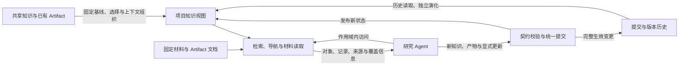

# Abstract（中文讨论初稿）

研究 Agent 在长期科研活动中持续形成论文理解、结果抽取、比较判断和综合报告。这些积累需要连同其对象、条件和材料依据一起保存，才能在后续任务与项目中继续使用。本文提出面向研究 Agent 的数据管理中间件，联合管理论文衍生知识、使用产物及版本化项目知识视图。系统通过语义数据模型连接共享对象、来源化内容和 Artifact，以可组合的操作契约保留访问与使用中的引用、判断范围和输入依赖；项目从明确的共享基线中选择知识与必要上下文，并通过完整提交记录与版本历史管理后续积累、独立探索和历史核查。外部 Agent 负责解释材料与作出语义判断，中间件负责结构、引用、作用域和状态变更的校验与执行。评测将检验操作与版本管理的正确性、知识及产物的质量、跨任务和跨项目使用效果，并报告构建、使用与维护的总成本。

# Introduction（中文讨论初稿）

研究 Agent 协助研究者开展文献调研、研究方案比较和论文撰写等工作。论文是这些活动的重要知识来源，Agent 通过阅读和理解论文，将相关研究知识用于当前任务。这一过程也不断产生新的数据：从表格中抽取的结果记录、对实验条件的比较判断，以及围绕研究问题形成的概述与报告。

研究者能够在长期研究过程中不断积累、回顾和组合领域中的已有工作，将相关论文中的关键思想、实验结果、方法选择，以及与其他工作（论文、代码、数据集）的联系，沉淀为研究笔记和知识体系。Agent 阅读与使用论文形成的理解若仅保留在当前会话中，后续任务就需要重新建立对象、条件和证据之间的联系。将这些理解及其使用产物转化为可检索、可组合的持久化数据，使后续任务能够从已有工作出发，检查其适用范围，并在需要时补充阅读与判断。

然而，需要持久化的论文知识具有复杂的结构和丰富的语义关系。这些知识不仅包括单篇论文的关键信息，还包含跨论文的语义联系，涉及方法、实验、代码、数据集、基准和引用关系等多模态、相互关联的内容。这类知识随着科研成果的增长持续扩展，需要以支持检索、比较、关联和推理的方式加以组织，以便在后续科研任务中复用。

共享积累还需要转化为具体项目的工作基础。不同项目关注不同问题，选用不同的论文知识与已有产物，并在使用中形成各自的判断。项目需要明确继承了共享库的哪个状态、选入了哪些内容、保留了什么上下文，以及后续提交怎样改变这些内容。项目知识视图与版本历史因此贯穿知识的管理和使用，使同一积累能够支持独立的研究路线，并允许 Agent 重访旧报告所依据的知识状态。

例如，一个项目需要为领域检索方法设计评测。共享库中已有论文 A、B、C 的知识及先前比较产物，Agent 判断其中 B、C 与当前需求相关，选择相应记录并建立项目视图。部分已有产物曾使用 A，项目可以保留这些产物的固定外部来源，或选用概述相关背景的新 Artifact，而不必带入 A 的完整子图与全部历史。随后，Agent 复用已有结果、补读缺失条件，提交新的比较与报告，再从同一项目状态开展不同评测路线。整个过程需要同时回答“产物用了什么”“项目纳入了什么”和“哪个提交建立了当前状态”。

文本笔记能够保存经验，图数据库能够连接对象，版本记录能够保存状态变化。本文关注这些能力在论文知识持续使用中的共同语义：**如何以数据模型和可组合操作，支持论文衍生知识及使用产物在项目中的表示、查询、组合、继承与演化？** 我们将其表述为面向外部研究 Agent 的数据管理中间件问题，以有界的 CS 研究任务作为应用与评价环境。

## 挑战

**不同知识与产物具有不同的复用粒度与身份规则。** 同一方法或资源可能在多篇论文中以不同名称出现，需要识别其共同身份；多篇论文也可能讨论同一个问题，却给出不同条件下的判断。与此同时，各论文中的具体实验、来源化主张，以及任务形成的结果行和报告需要分别保留。因此，需要连接共享对象、具体内容与派生产物，使后续操作能够引用合适的单位，并保留其来源语境。

**跨论文知识的组合需要保留条件与证据。** 方法选择和实验设计不仅需要找到相关知识，还需要判断这些知识是否适用于当前任务。例如，两篇论文使用同名 benchmark，并不足以说明其结果可以直接比较；两条结论方向不同，也不足以说明它们相互矛盾。Agent 需要同时取得所讨论的对象、适用条件、实验设置与支持依据，才能决定哪些经验能够沿用，哪些仍需重新验证。如何在组织和检索知识时保留这些联系，是支持可靠复用的关键问题。

操作组合还需要保留判断的范围与输入依赖。一份报告可能引用先前的比较判断，比较判断又引用多份抽取记录。稳定的对象与记录引用、明确的操作参数和来源谱系，使后续任务能够检查这条形成链，并区分已有判断的读取与新判断的产生。

**项目需要有选择地继承知识并保留必要上下文。** 选中 B、C 的节点，并不自动确定已有产物所需的依据、跨项目引用及缺失内容怎样处理。项目视图需要明确成员、基线、可见范围与选择依据，并允许通过固定引用和派生产物组织未展开的背景。项目内未选入的内容与全局删除具有不同含义，知识状态的继承也不要求携带全部形成历史。

**持续积累需要确定知识状态及其演化历史。** 新材料与新需求会引起内容修订和新产物写入，不同研究路线还会从共同起点独立发展。系统需要完整记录建立与改变状态的提交，支持历史访问、差异检查及有范围的整合。Artifact 的输入谱系说明内容如何形成，提交祖先关系说明状态如何演化；两者需要关联，同时保持各自的含义。

## 研究思路与内容

针对上述挑战，本文提出联合管理语义知识、使用产物和版本化项目知识视图的中间件。语义对象提供发现与解释的入口，Artifact 保存知识使用中形成的抽取、判断和综合结果，项目视图组织当前研究的工作基础，完整提交记录与版本历史管理这一基础的变化。外部 Agent 解释任务与材料并提交明确的内容或操作；中间件校验结构、引用和作用域，执行访问与状态变更，并保存来源和历史。

本文的核心贡献包括三个相互衔接的方面：

1. **语义知识与使用产物的数据模型。** 连接共享对象、来源化内容、材料与 Artifact，明确身份、复用粒度和来源引用，使先前任务形成的记录与判断能够被发现、核查和继续引用。
2. **可组合的操作与产物持久化机制。** 以类型化契约衔接访问、抽取、判断、综合和确定性组织，保留对象绑定、判断范围及声明的输入依赖，并通过统一写入机制将新积累纳入知识状态。
3. **版本化的项目知识管理机制。** 从固定基线中选择知识并组织上下文，建立项目工作基础，以完整提交记录支持后续积累、独立演化和历史核查，并明确选择性继承与跨范围整合的语义。

We propose a data-management middleware that jointly manages paper-derived knowledge, agent-produced artifacts, and versioned project knowledge views. The system connects semantic objects and reusable artifacts through provenance, supports their use through composable operation contracts, and records project initialization and committed changes so that projects can build on prior work, develop independent lines of inquiry, and revisit earlier knowledge states.

评测首先检验中间件对访问、组合、持久化和版本化项目管理的支持，再考察知识质量以及跨任务、跨项目使用中的回答与报告质量。构建、项目初始化、历史保存和维护成本与使用成本共同报告。

> 待补：具名贯穿案例、机制的形式化与执行细节、评测结果。

# 2. 研究背景、典型意图与问题定义

## 2.1 典型研究意图与知识复用

以一个具体研究任务为例：利用有限的领域标注数据，改善通用 embedding model 在专业文献检索中的表现，提出一种适配方法并完成实验验证。Agent 需要理解任务与数据、形成研究假设、选择和实现方法、设计评测，并根据结果不断调整方案。过去阅读形成的方法理解、条件辨析与证据联系，可以在这些活动中被重新使用。

下表列出这一任务中可能出现的研究意图。表中的经验与问题均为示意，用于说明数据模型需要支持的访问方式；它们尚不构成固定的评测任务集。

| 研究意图 | 需要复用的已有理解 | 对知识组织的要求 |
|---|---|---|
| 寻找研究切入点 | 不同工作如何处理训练文本、查询分布和负样本，各自声称的收益由哪些实验支持 | 连接研究问题、方法机制、具体主张与实验，保留尚未充分解释的因素 |
| 选择和改进方法 | 某个少样本方案是否还依赖大量领域语料或教师模型，哪些组件适合当前资源条件 | 识别共同方法及其变体，关联资源要求与适用条件 |
| 设计有解释力的评测 | 使用同名 benchmark 的论文是否采用相同切分、训练样本量、候选集合与后续处理 | 分别保存共同资源、论文中的使用方式和具体实验设置 |
| 把方案落实为实验 | 论文方法对应哪个实现、模型与配置，哪些材料提供使用线索 | 连接方法、资源与固定材料，保留已知信息及尚待核查的内容 |
| 解释结果并调整假设 | 哪些既有发现能为当前异常提供解释，其条件与当前设置有何差异 | 联合访问主张、作者解释、实验依据及其条件，保留相互竞争的解释 |
| 形成结论并说明贡献 | 当前方案沿用了什么、修改了什么，增加了哪些证据或适用范围 | 保留贡献、方法、主张与已有工作之间的联系，支持有依据的比较 |

这些意图可以交替出现，也可能在不同任务中重复出现。例如，Agent 在准备实验时发现资源版本与论文描述不一致，可能重新检查方法选择；实验结果未达到预期，又可能触发新的文献阅读和条件比较。知识库需要支持在不同意图之间访问共同的知识，同时保留每项经验形成时的依据与适用范围。

长期复用还要求区分经验积累与当前判断。先前记录可以帮助 Agent 发现相关方法、识别设置差异和提出解释，但当前任务中的结论仍需结合当前材料与新实验确认。本文希望保存的是后续研究能够继续使用的理解及其依据，使 Agent 能够从已有认识出发推进任务。

这些知识利用需求发生在持续演化的项目中。项目先从共享积累中选择相关知识，记录基线和上下文，再通过多次访问与提交形成新的 Artifact；后续任务可以沿用已有产物，也可以从某个状态分出新的研究路线。因此，工作负载同时包含项目初始化、知识访问与组合、新知识及产物写入、历史读取和分支演化。每项工作负载需要明确输入、可见状态、允许的操作及参考输出。

## 2.2 相关研究与建模依据

**Agent Memory 与科学研究记忆。** Agent Memory 研究已经探索了历史经验的结构化组织、关联和更新。A-MEM 将记忆组织为具有上下文描述等属性的笔记，并在新增记忆时建立联系、调整已有记忆的表示；Zep 通过时序知识图谱整合持续到来的信息并保留历史关系。这些工作为知识的持续组织与维护提供了参考。[A-MEM](https://arxiv.org/abs/2502.12110)、[Zep](https://arxiv.org/abs/2501.13956v1)

科学研究场景进一步涉及文献理解、实验记录和跨项目经验。AutoSci 将持久化科学记忆作为研究系统的基础，区分可复用的长期知识与项目中的研究产物，并将记忆与研究活动及反馈相联系。本文与这一方向共享持续积累科研知识的动机，聚焦论文衍生知识及其使用产物在项目中的表示、组合和演化，并将外部 Agent 的语义判断与中间件的数据管理责任分开。[AutoSci](https://arxiv.org/abs/2605.31468v1)

**学术知识的数据管理。** AgenticScholar 面向学术语料上的检索、信息综合与知识发现，将细粒度文档内容与问题、方法 taxonomy 结合，并通过查询规划和算子执行支持多步分析。它展示了从典型学术查询推导知识组织与访问机制的设计路径。本文将操作形成的结果持久化为可继续引用的 Artifact，并通过项目视图及版本历史管理后续使用；语义操作的内容由外部 Agent 提供，中间件负责契约校验和执行。与 AgenticScholar 的具体能力差异需要通过相同材料与任务下的比较进一步界定。[AgenticScholar](https://arxiv.org/abs/2603.13774v1)

**科学知识的语义表示。** ORKG 以研究贡献连接研究问题、方法与结果，为论文内容的结构化提供了领域参照。Micropublications 组织自然语言主张、证据、来源及支持和质疑关系，并通过共同表述关联具有相近含义的主张。IBIS 则区分问题、回应问题的立场，以及支持或反对立场的论据。这些工作为本文区分研究对象、具体主张、共同命题和研究问题提供了基本参考。[ORKG](https://arxiv.org/abs/1901.10816)、[Micropublications](https://link.springer.com/article/10.1186/2041-1480-5-28)、[gIBIS](https://ase.in.tum.de/lehrstuhl_1/files/teaching/Lehrstuhl/DesignRationaleWiSe2003/conklin_1988.pdf)

**版本化数据管理。** Git4Data 为数据库内的快照、分支、差异与整合提供参照；Efficient Snapshot Retrieval over Historical Graph Data 研究图历史的保存与快照恢复，为区分逻辑状态和物理恢复结构提供依据。本文将版本机制用于项目知识的选择性继承与持续使用，分别表达 Artifact 的形成来源、项目初始化来源和提交祖先关系。项目可以继承选定状态而不复制全部上游历史，摘要承担上下文组织的作用，精确历史访问仍依赖保留的状态与变更数据。[Git4Data](https://arxiv.org/abs/2609.02106v1)（`2026-Git4Data`）、[Efficient Snapshot Retrieval over Historical Graph Data](https://doi.org/10.1109/ICDE.2013.6544892)（`2013-GraphSnapshot`）

上述研究分别提供了记忆组织、学术查询、科学论证表示与版本管理的基础。本文结合第 2.1 节中的需求，组织语义对象、持久产物、项目范围与状态演化的共同契约。比较将围绕具体访问与更新工作负载展开，区分已有方法原生支持、可组合实现及需要额外开发的能力。

> 待补：补充 database provenance 与 persistent derived data 的文献，完善学术知识系统、Agent Memory 和版本化数据管理的操作级比较。

## 2.3 问题定义与研究范围

本文研究的输入包括逐步获得的论文与相关材料、Agent 提交的知识记录和使用产物，以及项目的知识选择与更新操作。研究 Agent 在不同时间访问明确作用域中的知识状态，利用已有积累完成当前任务，并提交新的材料、理解与产物。中间件管理共享库和项目知识视图，记录其建立与演化，使后续任务能够确定当前可用内容及历史依据。

一项知识记录需要说明所讨论的内容及其语义角色，并能够取得解释该内容所需的条件与依据。共享对象提供跨论文查找的入口，具体主张和实验保留来源语境，Observation 保存提交者明确记录的理解，Artifact 保存操作的结果、参数及声明的输入依赖。项目视图规定选入哪些内容及如何访问上下文，提交记录确定这些内容在哪个状态中被采纳或修改。

知识访问的输出包括对象候选、主张、实验、Artifact 及其记录引用、材料位置和对象绑定，同时说明访问范围、缺失与截断情况。Agent 根据当前任务判断对象身份、结论适用性和结果可比性，必要时读取固定材料补查。中间件验证声明的结构与引用，执行确定性操作并持久化结果；输入谱系和版本记录不替代语义判断，也不构成完整推理轨迹。

研究范围覆盖语义模型与算子、持久化使用产物及来源谱系、项目知识视图和完整提交／版本历史。论文中的实验声明、Agent 对材料的判断和真实执行结果具有不同含义；当前知识构建与使用不以仓库检查、代码执行或实验复现为前提。评价聚焦有界 CS 任务中的数据管理支持，分别检验中间件执行正确性与外部 Agent 的知识使用质量。

# 3. 系统概览

系统围绕材料访问、语义知识与 Artifact 管理、可组合操作以及版本化项目视图组织。研究 Agent 在确定的项目或共享库状态中读取知识、判断适用性并提交新积累。中间件将所有知识与产物写入接入统一的变更记录机制，使内容来源与状态历史可以共同核查。

## 3.1 材料访问与依据定位

论文正文、表格、图和附录共同提供理解研究内容的材料，关联资源的说明可以补充实现与使用信息。系统通过 Material 登记固定内容与位置标识，使知识记录能够指向具体材料版本。Artifact 文档也登记为 Material，论文原文与已有使用产物可以通过同一材料接口读取。对于暂未获得的材料，保留已知入口和来源。

知识库保存 Agent 整理的理解，并通过依据位置连接材料。例如，一条关于方法效果的主张关联实验与表图，比较产物引用抽取记录，抽取记录再定位到论文中的条件与数值。Agent 在取得知识后，可以沿这些联系进一步核对细节。材料哈希用于检查内容是否一致，历史读取还需要保留对应内容的可访问副本。

## 3.2 知识构建与维护

构建过程接收 Agent 阅读产生的记录和显式更新。Agent 查找已有对象并判断应当复用、补充还是新建，中间件检查类型、身份约束、引用及目标作用域，计算和提交实际变更。共享对象及跨论文联系用于连接已有知识，具体实验、主张来源和 Agent 形成的判断分别保留。

持续维护通过明确的提交接纳新材料、内容修订和新 Artifact，并保留此前状态。固定材料引用、内容哈希与输入依赖用于提示产物可能受到的影响；是否需要重新解释证据、修订判断或生成新产物，由外部 Agent 决定。统一提交机制覆盖知识入库和 Artifact 写入，记录实际生效的节点、关系、属性及绑定变化。

## 3.3 面向研究意图的知识访问

Agent 可以从对象称呼、完整陈述或研究问题进入知识库，再沿关系取得方法、主张、实验及已有 Artifact。Search、Resolve、Traverse 和 ReadEvidence 提供定位、导航及材料读取；Extract、Check、Verify、Summarize 等契约接收 Agent 形成的记录与判断，将结果保存为后续操作可引用的产物。对于知识库尚未覆盖或依据不足的问题，Agent 可以继续读取材料、补查或保留不确定性。

图中展示的是系统的数据流与职责，箭头不表示 Artifact 的输入边或 Commit 的父子边。一次任务可以多次交替访问知识、形成产物和提交更新；新积累进入明确的项目状态，同时保留其形成来源和采纳历史。

## 3.4 项目知识视图与独立演化

项目从共享库的固定基线选择相关对象、记录和产物，并记录选择依据及上下文处理方式。共享库后续增长不隐式改写项目起点；项目通过显式操作吸收新知识，也可以把选定的项目产物回流到共享库。分支从已记录状态开始，后续写入具有明确归属。

来源谱系与版本历史分别回答不同问题。一份 Artifact 可以使用多个历史状态中的输入，一次提交也可以纳入多份 Artifact。项目历史记录其知识状态如何建立与演化，Artifact 的输入谱系记录产物声明使用了什么；二者通过固定引用关联。项目可以只继承选定知识状态，并从新的初始化提交开始保留完整本地历史。

# 4. 面向知识复用的语义模型与操作设计

## 4.1 共享身份与具体知识记录

第 2.1 节中的研究意图要求知识库同时支持跨论文查找和具体条件核对。模型因此将对象的共同身份与论文中的具体描述、使用和发现分别表示，再通过关系连接。下表按设计作用组织当前节点类型。

| 设计作用 | 节点类型 | 保存的内容与复用方式 |
|---|---|---|
| 为资源提供共享身份 | Entity：Paper、Dataset、Code、Model、Benchmark 等 | 保存名称、标识及资源描述；在确认身份一致后共同引用 |
| 为定义与跨论文判断提供入口 | Concept：Method、Task、Proposition、Issue | 保存方法与任务定义、共同命题与研究问题，连接来源化内容 |
| 保留论文内容与明确记录的理解 | Content：Contribution、Claim、Experiment、Observation | 区分论文陈述与 Agent 理解，保存形成信息、讨论对象和材料依据 |
| 保留知识使用的产物 | Artifact | 保存抽取、比较、概述、表格与报告的操作参数、输入依赖及文档；内部记录可独立引用 |

这些分组说明节点的身份与来源作用，不将检索、归并和溯源划分为互斥的操作层。具体 Claim 可以被其他论文或研究任务检索和引用，其来源记录仍保持独立。Observation 保存阅读者明确提交的理解与评估，可以关联多个对象；Artifact 保存一次知识使用操作的产物，并通过声明的输入依赖连接已有知识和产物。

共享对象的识别需要结合名称、定义与材料。例如，某个方法方案、同名模型权重与实现仓库可以相关，但承担不同角色；两个实验使用同一数据集，也可能采用不同切分或处理方式。共同名称提供查找线索，Experiment 与参与关系连接具体实验和资源；版本、切分及指标口径等细节通过固定材料取得，在任务需要时抽取为 Artifact 记录。

模型采用图结构与自然语言相结合的表示。基础图以轻度提炼的内容和锚点组织发现与访问入口，原文中的条件明细、数值和表图按需读取。Extract 将任务所需的结果行持久化为带来源的 Artifact，后续操作引用已有记录并检查适用范围。Material、名称注册与提交记录支撑解析、内容访问和状态管理，与领域语义对象分别表达。

## 4.2 区分共同命题、共同问题与具体主张

跨论文的语义组织需要区分“表达相同判断”与“讨论同一问题”。Claim 保存某篇论文中的具体主张及其条件和依据；Proposition 为共同命题提供入口；Issue 则组织同一研究问题，允许相关主张给出不同或相反的回答。

例如，“更难的负样本是否改善领域检索”可以作为一个研究问题。不同论文可能报告改善、下降或只在部分查询上有效，这些主张可以共同关联该问题。是否进一步将其中若干主张组织到同一命题下，需要比较其内容及必要限定。仅仅讨论相同对象、同时成立或具有相近文字，都不足以认定它们表达同一命题。

模型通过 `ABOUT` 连接内容与所讨论的对象，包括共同命题和研究问题；`SUPPORTS`、`OPPOSES` 等关系记录声明的语义联系。关系的方向、说明、形成者及来源表达联系的范围和依据，不能仅凭关联到同一 Concept 推导语义等价或证据支持。

这些联系为 Agent 提供组织相关经验的路径。沿支持关系找到的内容需要结合实验条件阅读；共同问题下的不同回答也需要检查其差异来源。模型不将图上的可达性直接解释为结论成立，也不把经验支持直接等同于逻辑蕴含。

> 待补：共同命题的判定样例、关系约束，以及外部 Agent 判断与中间件校验的对应规则。

## 4.3 从候选召回到身份与关系判断

知识构建首先需要找到与新内容可能相关的已有记录。实体与命题的检索目标不同，因此采用不同的查询入口。实体检索以论文中的称呼为起点，结合名称、其他称呼和描述寻找可能指向同一对象的候选；命题与问题检索以完整陈述或问题为起点，寻找含义相关、需要进一步比较的记录。

Resolve 根据标识和名称注册规则解析称呼，并区分唯一匹配、候选、歧义与冲突；Search 结合词匹配、向量与结构条件发现相关对象。结果保留匹配依据与访问范围。需要语义确认时，Agent 可通过 Filter 对候选逐项判断，并保存所用依据；中间件不根据文本相似度自动作出身份判断。

命题与问题检索拟结合陈述内容的词匹配与语义检索。候选范围还需要考虑已有的论文级 Claim：当库中尚未形成共同命题时，先前论文的具体主张仍可能提供建立跨论文联系的线索。返回结果需要区分具体主张、共同命题与研究问题，使 Agent 能够选择引用已有记录、建立语义联系或保留独立记录。

候选召回与语义判断分别承担不同职责。前者希望减少遗漏相关记录，后者需要核对定义、条件、版本和来源。名称命中与语义相近都不能单独决定归并；无法确认时保留独立记录与不确定性，避免通过省略条件获得表面一致。

> 待补：命题检索的候选范围与输入组织、实体和命题判断的具体程序、关系生成与校验方法。上述检索方式为当前原型与设计起点，尚未构成经过验证的完整构建算法。

## 4.4 条件与依据的联合访问

完成候选定位后，Agent 需要取得与当前判断有关的上下文。以比较两个方法的实验结果为例，访问过程需要连接被测方法、具体 Experiment 与所用资源，并读取指标、数据切分、处理方式和后续步骤等条件。共享 benchmark 节点帮助定位相关实验，实验描述和材料锚点提供进一步检查其使用方式的入口。

对于方法适用性问题，可以从 Method 取得相关主张和资源要求，再沿实验及原文依据核对这些前提。对于结果解释问题，可以从 Issue 或相关 Claim 出发，取得不同解释及支持材料，比较它们与当前设置的对应关系。查询返回的知识范围应当随研究意图确定，同时保留影响判断的条件与依据。

基础图中的实验描述与锚点提供条件访问的入口。Agent 经 ReadEvidence 读取固定材料，使用 Extract 保存所需条件与结果，再通过 Check 声明比较维度并提交逐项判断。Rank 和 MatrixConstruct 对已有记录执行排序与透视，Generate 引用这些产物形成回答。组合过程保留记录键、来源及判断范围；缺失条件以不确定性表达，不由共享资源或共同参与关系补齐。

操作结果同时保留对象绑定、路径依据、覆盖范围和缺失信息。例如，Observation 关于多个对象形成比较，返回其中一个命中的对象时仍需保留完整讨论范围；结果因预算截断时应报告截断，不能将部分返回解释为完整集合。项目作用域与读取状态也需要随操作传递，避免组合不同状态的数据而不作说明。

## 4.5 来源区分与持续维护

知识的来源决定其能够支持什么判断。Claim 表达论文作者的主张，Observation 表达阅读者明确提交的理解，Artifact 记录一次操作形成的工作产物。Agent 可以通过 Verify 判断主张在指定材料下的支持情况，并将需要采纳的理解经 Commit 写成 Observation。记录这一采纳行为保留了责任与依据，不代表系统独立验证了判断的真实性。

材料采用固定引用与内容哈希，Artifact 通过 `USED` 声明输入。材料不可访问、哈希不一致或输入依赖可能失效时，系统提供复查提示；新的材料解释由 Agent 形成新的记录。Artifact 及其文档保持不可变，修订产物使用新的身份，原有内容与依赖仍可核查。

新的论文主张可以补充或限定既有认识。对可修改知识对象的更新经版本机制记录，旧状态仍可访问，产物则需要指向形成时实际声明的输入版本。Agent 的读取可能早于产物写入，因此不能把 Artifact 的采纳提交直接当作它的输入状态。来源谱系记录声明的依赖与形成信息，不承诺捕获全部阅读行为或推理步骤。

> 待补：可修改对象的历史引用表示、材料保留与依赖检查的实现，以及知识修订后的复查流程。

## 4.6 操作组合与 Artifact 持久化

Agent 算子以输入引用、操作参数、形成信息和结果内容构成契约。Extract 保存结构化记录，Summarize 压缩与重组已有输入，Generate 形成新的回答或方案；Check、Verify、Filter 保存有明确范围和依据的判断。内容由外部 Agent 提供，中间件校验类型、引用和结果结构。Rank、MatrixConstruct 等确定性组织由中间件执行。

Artifact 具有稳定身份，正文登记为 Material，内部记录通过 Artifact 标识和记录键引用。正文中引用的内容需要属于声明输入，判断类操作需要覆盖声明的判断单元。后续任务可以搜索已有产物、沿 `USED` 检查输入，再读取记录与原文继续组合。校验保证结构和引用符合契约，摘要忠实度、判断正确性及任务适用性分别评价。

以实验比较为例，Agent 定位论文 B、C 的 Experiment，读取表格与条件，Extract 形成结果记录，Check 保存各比较维度的判断，MatrixConstruct 组织选定记录，Generate 形成报告。抽取、判断、组织与生成步骤保存可引用的产物及输入依赖；后续项目可以继承其中合适的记录或判断，并对新的任务条件重新检查。

所有 Artifact 写入与知识更新使用同一提交机制。产物的形成信息回答操作使用了什么及产出了什么，提交记录回答哪些变更在目标作用域中实际生效，两者共同支持后续读取与维护。

## 4.7 项目知识的选择性继承

项目初始化确定共享库基线、选定对象与版本、成员范围及上下文处理方式。项目视图可以包含原样继承的知识，也可以包含为项目新形成的概述等 Artifact。外部 Agent 判断相关性与上下文是否足够，中间件校验选择结果的结构、引用及作用域，并记录构成起始状态的内容。

对于 A、B、C 的例子，B、C 与 A 出现在同一提交中，不表示 B、C 的内容依赖 A；原有 Artifact 若实际使用了 A，其形成来源也不会因项目省略 A 而消失。项目可以保留固定外部引用，选择另行形成的派生产物，或不纳入该 Artifact。不能把原产物指向 A 的输入关系改成指向后来生成的摘要，并继续保留原产物身份。

知识状态的继承与提交历史的继承分别规定。项目可以取得 B、C 在固定基线下的选定状态，加入必要上下文，并以可恢复的初始化快照或完整变更集建立新的根提交。全局来源通过初始化记录保留，不必成为本地的普通父提交。本地完整历史从该起点开始，更早的形成过程按声明的外部引用与保留范围访问。

Summarize 可以围绕项目需求概述上游经验，形成 branch summary Artifact。其输入应固定到具体材料、对象版本或历史范围，Commit 记录摘要何时被纳入项目以及承担的上下文作用。历史日志能够说明改了什么，解释为何修改还需要提交说明或判断产物。摘要保存与项目有关的经验，精确恢复旧状态则依赖保留的快照或变更数据。

项目内移除与全局撤回分别表达，未选入的对象不被当作删除。后续吸收或回流知识需要明确接纳范围、来源映射与比较基线；从新根开始的项目不能只依靠共同提交祖先确定整合关系。结构约束由中间件检查，语义冲突和经验的适用性由 Agent 判断。

> 待补：项目成员与外部引用的具体表示、Summarize 的历史输入契约，以及吸收与回流的操作规则。

## 4.8 完整提交与历史状态语义

一次提交以明确基线和目标作用域为输入，记录实际生效的节点、关系、属性与绑定变化，并发布新的知识状态。完整记录覆盖初始知识入库、后续修订以及 Artifact 写入；批次统计或最新批次标识不能替代恢复状态所需的数据。提交需要检查写入前提，避免过期读取形成的更新静默覆盖后续变化。

令 $S_{p,c}$ 表示项目 $p$ 在提交 $c$ 下的逻辑状态。对受版本管理状态上的确定性查询 $q$，历史读取的目标语义为：

$$
\operatorname{ReadAt}(p,c,q)=q(S_{p,c}).
$$

逻辑状态包含所声明的知识、Artifact、成员与绑定，以及固定材料引用。历史读取需要取得相应内容，物理上采用快照、delta 或对象共享均应保持上述语义。项目以摘要组织上游背景时，可以精确恢复自身状态，但不能由此承诺恢复未保留的全局历史。

写入与整合从合法状态出发，经校验后产生满足类型、身份、引用和作用域约束的新状态。变更与提交记录应一致发布；分支写入不得隐式改变其他分支的可见状态。Artifact 输入谱系、项目初始化来源、提交祖先关系和物理恢复关系分别表达，这些保证与语义内容是否真实分别验证。

> 待补：提交粒度、历史引用与状态保留方案，以及操作到后端执行的映射和正确性论证。

# 5. 实现细节

## 5.1 知识与材料存储

当前原型采用 Neo4j 的属性图表示节点、关系及其属性。节点使用不带语义的图内标识，名称、类型与来源通过独立属性和关系表达。名称变化不直接改变节点身份，对象是否相同仍由内容与来源判断。

已处理的论文材料通过固定材料标识和 Markdown 位置访问，知识记录中的锚点指向相应章节或内容块。Artifact 的正文也保存为材料，其节点与 `USED` 关系进入图。图状态与材料内容分别保存，通过固定引用与哈希关联；历史内容的保留和读取需要与图的版本管理共同实现。

## 5.2 检索索引与派生表示

原型分别定义名称全文索引、描述全文索引与陈述全文索引，并为共享实体和陈述内容准备向量索引。已有实体检索实现使用名称与 aliases 匹配、全文检索和语义检索提供候选，对混合召回结果采用 Reciprocal Rank Fusion（RRF）进行排序融合。

现有检索探索使用 Qwen3-Embedding-8B。embedding 属于用于检索的派生属性，通过模型标识与输入文本的哈希判断是否需要更新。检索配置与模型选择属于实现和实验设置，后续需要记录其具体版本、参数与成本，并检验它们对候选质量的影响。历史逻辑状态的恢复与检索索引的重建分别处理；若需要复现检索排序，还需要固定对应配置，不能仅由知识状态相同推出排序相同。

## 5.3 统一写入与可复现记录

写入设计采用读写同形的 graph-doc 表达目标知识状态，由中间件完成校验、差异计算和变更集提交。知识修改与 Agent 算子的 Artifact 写入共享底层机制，提交记录保存实际生效的变化及其基线。图内变更、提交记录和分支头需要在事务中一致发布；图外材料的保存、失败处理及内容校验与这一过程衔接。

版本存储服务于项目建立、独立演化、历史访问和知识整合。快照、delta、物化方式和提交粒度根据这些操作的契约与成本确定，不将某种存储优化作为项目版本语义成立的前提。实现分层区分领域结构与引用校验、物理图变更以及版本记录，便于单独检查状态变更是否符合上层操作。

后续实验需要保存输入材料及其版本、模型与提示配置、工具交互、项目基线、提交变化和评价结果。构建、项目初始化、使用与维护成本分别记录；检索候选、Agent 的判断、校验结果与最终生效变化也需要分别观察，以定位召回、理解和更新中的错误。

> 待补：完整实现流程、各机制的实现覆盖、运行环境、参数配置、失败处理和可复现入口。

# 6. 实验评测

实验首先检验中间件能否正确支持知识访问与组合、产物持久化、项目建立、完整变更记录和版本化状态访问，并分析执行、交互与维护成本。在此基础上，评价所管理的知识及产物是否忠实保留内容、条件和依据，以及它们是否有助于后续研究任务。具体任务、材料与判分协议仍待确定。

## 6.1 任务与材料组织

评测拟从第 2.1 节中的研究意图选取范围明确的任务，并为每项任务规定可访问材料、已有知识状态、目标项目与计算预算。静态任务考察召回、组合与条件判断；连续任务覆盖从共享库建立项目、复用和提交产物、分支探索，以及新材料到来后的历史核查与更新。各阶段能够获得的信息分别控制，项目初始化不提前获知全部后续任务。

例如，先前任务记录某个 benchmark 的使用差异，项目选择相关抽取和比较产物作为评测设计的基础，之后补入新论文并形成两条研究路线。评价检查选定内容及依赖如何进入项目、后续提交是否保持作用域，以及旧报告所依据的状态能否取得。摘要化上下文的设置还需要独立检查摘要忠实度、必要条件是否保留和后续补查成本。

## 6.2 中间件正确性与知识质量

中间件评价固定输入状态、操作序列与参考结果，检查以下目标：

| 管理环节 | 需要检验的结果 |
|---|---|
| 访问与组合 | 对象绑定、记录引用、判断范围及缺失／截断信息按契约保留 |
| 产物与提交 | Artifact 及其输入引用正确保存，实际生效变化与提交记录一致，失败时不发布部分状态 |
| 项目初始化与整合 | 原样继承的内容与来源基线一致，派生产物和外部上下文明确，未选入不被解释为删除 |
| 历史与分支 | 历史读取符合固定状态，材料可访问，独立分支的写入互不隐式影响 |

这些检查与语义质量评价分别进行。结构合法、来源链接存在和历史状态可恢复，都不能单独证明知识或判断得到材料支持。

知识质量评价需要检查对象身份是否正确、主张是否忠实保留必要条件、实验和使用记录是否对应正确，以及跨论文联系是否得到材料支持。对于身份归并，同时检查错误合并与重复记录；对于语义关系，检查端点、关系含义和适用范围；对于证据，分别检查位置是否可访问、内容是否相关，以及是否足以支持所保存的判断。

评价应当具有独立于构建过程的核查依据。对容易混淆的对象、条件相近的主张及不同版本记录，需要设置能够暴露错误的样例。若使用模型辅助评价，需要说明评价模型、核查材料与人工复核方式，避免仅让构建模型确认自己的输出。

## 6.3 研究记忆能力与后续任务效果

后续任务评价围绕以下能力展开。它们可以由同一项任务共同检验，不要求每种能力对应独立的系统模块。

| 能力 | 需要检验的效果 |
|---|---|
| C1：知识召回 | 能否准确取得具体事实、使用记录及相应依据 |
| C2：跨记录组合 | 能否连接多个论文或历史记录，形成有依据的综合判断 |
| C3：条件意识 | 能否辨认影响可比性和适用性的条件，避免错误组合 |
| C4：记忆演化 | 新材料或项目需求变化后，能否检查已有产物的适用性，并保留先前结果的依据 |
| C5：证据与认识状态 | 能否区分作者主张、Agent 判断与未知内容，给出恰当依据 |
| C6：跨任务与跨项目复用 | 项目继承的知识与产物能否帮助后续任务，必要上下文是否充分，是否减少重复阅读与判断 |

任务效果需要与具体研究判断联系起来。例如，方法选择是否遗漏关键前提，实验对照是否采用可比条件，结果解释是否得到材料支持，以及引用是否对应实际证据。评测还需检查积累过程中的错误是否被后续任务继承或放大。

## 6.4 对照方法与成本

对照方法拟覆盖直接访问原始材料、文本笔记或检索记忆、已有结构化记忆方法，以及配置适当查询、来源与版本记录的通用图数据库或文档存储方案。比较具体工作负载的结果正确性、交互与执行成本，区分原生支持、通过组合支持及需要额外实现的部分。具体方法及适配方式需要在实验前确定。

受控比较固定已有知识、材料访问和外部 Agent 条件，检验操作与管理机制的作用；端到端比较再纳入知识构建与项目初始化的质量和成本。项目视图与全局按需访问比较时，双方均允许合理保存产物和补查，避免将单纯缺少持久化能力作为对照劣势。

各方法应当具有等价的信息访问条件，并明确积累阶段与使用阶段的预算。成本统计知识构建、项目初始化、摘要生成、任务使用、更新与历史保存所消耗的模型调用、输入输出 token、时间、工具和存储开销。规模分析考察知识量、产物及依赖数量、项目选择范围和历史长度变化时的行为。重复任务中的收益与前期投入及维护成本共同分析。

对具体机制的分析围绕贡献主张开展，例如检查记录级引用、判断范围、Artifact 持久化、项目上下文和历史访问分别影响哪些结果。项目继承可以比较完整保留、固定外部引用、摘要承接及新根初始化等设置，同时报告质量与总成本。具体比较范围根据最终工作负载确定。

## 6.5 结果与案例分析

> 待补：材料与任务规模、中间件及版本正确性结果、知识与产物质量、跨任务／项目使用效果、成本和规模分析及机制对照。

案例分析将沿项目建立、知识使用、产物提交与分支演化，展示继承了哪些已有工作、这些知识如何影响判断，以及哪些内容仍需重新查证。成功与失败案例都保留相关记录、条件、依赖及提交状态，使读者能够区分已有理解的复用、额外信息访问、模型差异与预算变化的影响。

# 7. 结论

本文提出面向研究 Agent 的论文衍生知识数据管理中间件，联合管理语义知识、使用产物与版本化项目知识视图。语义模型连接共享对象、来源化内容和 Artifact，可组合操作保留知识使用中的引用、范围和输入依赖，项目视图与完整提交历史管理知识的选择性继承和后续演化。这一设计使持续积累的论文经验能够成为明确、可核查且可继续更新的项目工作基础。

评测将分别检验中间件的执行与状态管理保证、知识及产物的语义质量，以及后续任务中的使用效果，明确构建、项目组织、历史保存与持续使用之间的成本关系。

> 待补：在实验完成后，用经过验证的主要发现、适用范围与局限替换本节中的研究展望。
